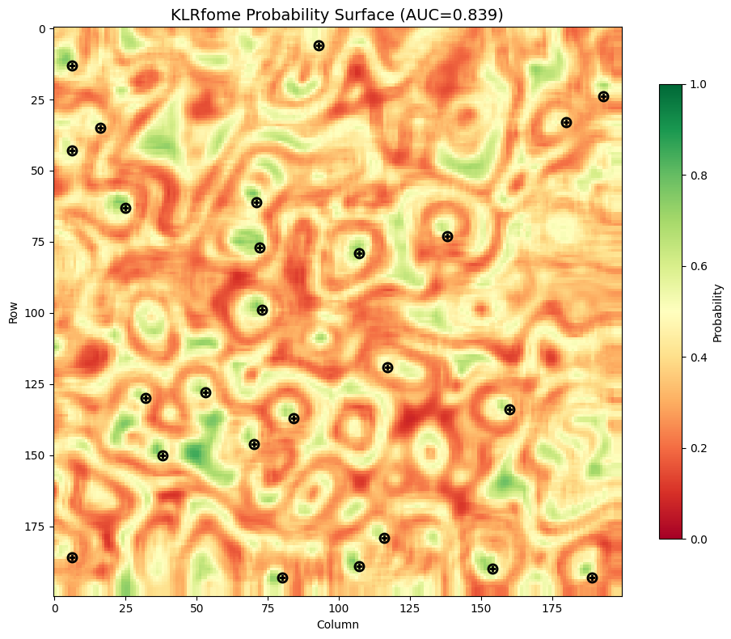

[](https://www.python.org/downloads/)
[](https://github.com/google/jax)
[](https://zenodo.org/badge/latestdoi/103055953)

<p align="center">

</p>

# KLRfome - Kernel Logistic Regression on Focal Mean Embeddings

**Python/JAX implementation** for GPU-accelerated distribution regression on geospatial data.

> Originally developed for archaeological site prediction, KLRfome solves **Distribution Regression** problems where each observation is characterized by a *distribution* of measurements rather than a single feature vector.

**Original R Package**: [mrecos/klrfome](https://github.com/mrecos/klrfome)  
**Documentation**: [mrecos.github.io/klrfome](https://mrecos.github.io/klrfome/)  
**Paper**: Harris, M.D. (2019). KLRfome - Kernel Logistic Regression on Focal Mean Embeddings. *Journal of Open Source Software*, 4(35), 722.

---

## The Problem: Distribution Regression

Traditional regression maps a single outcome to a single set of features—one observation, one feature vector. But many real-world problems don't fit this mold.

**Distribution Regression** maps a single outcome to a *distribution* of features:

| Traditional Regression | Distribution Regression |
|----------------------|------------------------|
| One feature vector per observation | Many feature vectors per observation |
| Point measurements | Spatially distributed measurements |
| Collapse distribution to summary statistics | Model the full distribution |

### When to Use KLRfome

KLRfome is designed for problems where:

1. **Observations are spatial regions**, not points (e.g., site boundaries, habitat patches, land parcels)
2. **Each region contains multiple measurements** of environmental or contextual variables
3. **You want to predict** the probability of an outcome across a landscape

| Domain | Observation Unit | Distribution of Features |
|--------|-----------------|-------------------------|
| Archaeology | Site boundary | Environmental measurements within site |
| Ecology | Habitat patch | Species observations across patch |
| Remote Sensing | Land parcel | Pixel values within parcel |
| Urban Planning | Neighborhood | Property characteristics in area |
| Environmental Science | Watershed | Sensor readings across watershed |

<p align="center">

</p>

---

## How KLRfome Works

<p align="left">

</p>

1. **Represent** each location as a collection ("bag") of environmental feature vectors sampled from within its boundary
2. **Compute similarity** between locations using mean embeddings in a Reproducing Kernel Hilbert Space (RKHS)
3. **Fit** Kernel Logistic Regression on the resulting similarity matrix
4. **Predict** across the landscape using focal windows that compute similarity between each neighborhood and the training locations

The name derives from this approach: **K**ernel **L**ogistic **R**egression on **FO**cal **M**ean **E**mbeddings (**KLRfome**, pronounced *"clear foam"*).

---

## Installation

```bash
# From PyPI (when available)
pip install klrfome

# From source
git clone https://github.com/mrecos/KLRFome_JAX
cd KLRFome_JAX
pip install -e .
```

### Requirements

- Python 3.9+
- JAX (with optional GPU support)
- NumPy, Rasterio, GeoPandas

For GPU acceleration, install JAX with CUDA support:
```bash
pip install --upgrade "jax[cuda12]"
```

---

## Quick Start

Example data is included in `example_data/` so you can run this immediately after installation:

```python
from klrfome import KLRfome, RasterStack
import geopandas as gpd
import numpy as np
import rasterio
from sklearn.metrics import roc_auc_score
import matplotlib.pyplot as plt

# Load the included example data (200x200 rasters, 25 sites)
raster_stack = RasterStack.from_files([
    'example_data/var1.tif',
    'example_data/var2.tif', 
    'example_data/var3.tif'
])
sites = gpd.read_file('example_data/sites.geojson')

# Initialize model with hyperparameters
model = KLRfome(
    sigma=0.5,          # RBF kernel width (controls similarity decay)
    lambda_reg=0.1,     # Regularization strength
    window_size=5,      # Focal window size for prediction
    n_rff_features=256  # Random Fourier Features (0 for exact kernel)
)

# Prepare training data: extract samples at sites and background locations
training_data = model.prepare_data(
    raster_stack=raster_stack,
    sites=sites,
    n_background=50,           # Number of background sample locations
    samples_per_location=20    # Samples per site/background location
)

# Fit the model
model.fit(training_data)

# Predict probability surface across the landscape
predictions = model.predict(raster_stack)
print(f"Predictions shape: {predictions.shape}")
print(f"Probability range: [{predictions.min():.3f}, {predictions.max():.3f}]")
```

### Evaluate Model Performance

```python
# Extract predictions at site locations
transform = raster_stack.transform
site_preds = []
for idx, row in sites.iterrows():
    r, c = rasterio.transform.rowcol(transform, row.geometry.x, row.geometry.y)
    if 0 <= r < predictions.shape[0] and 0 <= c < predictions.shape[1]:
        site_preds.append(float(predictions[r, c]))

# Sample background predictions
np.random.seed(42)
bg_preds = [float(predictions[np.random.randint(0, predictions.shape[0]),
                              np.random.randint(0, predictions.shape[1])]) 
            for _ in range(200)]

# Compute metrics
all_preds = site_preds + bg_preds
all_labels = [1] * len(site_preds) + [0] * len(bg_preds)
auc = roc_auc_score(all_labels, all_preds)

# Find optimal threshold (Youden's J)
thresholds = np.linspace(0, 1, 100)
best_j, best_thresh = 0, 0.5
for t in thresholds:
    tp = sum((p >= t and l == 1) for p, l in zip(all_preds, all_labels))
    tn = sum((p < t and l == 0) for p, l in zip(all_preds, all_labels))
    sens = tp / sum(all_labels)
    spec = tn / (len(all_labels) - sum(all_labels))
    j = sens + spec - 1
    if j > best_j:
        best_j, best_thresh = j, t

print(f"\n=== Model Performance ===")
print(f"AUC: {auc:.3f}")
print(f"Optimal Threshold: {best_thresh:.2f}")
print(f"Youden's J: {best_j:.3f}")
print(f"Site prediction mean: {np.mean(site_preds):.3f}")
print(f"Background prediction mean: {np.mean(bg_preds):.3f}")
```

### Visualize Predictions

```python
# Plot prediction surface with site locations
fig, ax = plt.subplots(1, 1, figsize=(10, 8))

# Plot probability surface
im = ax.imshow(predictions, cmap='RdYlGn', vmin=0, vmax=1, origin='upper')
plt.colorbar(im, ax=ax, label='Probability', shrink=0.8)

# Overlay site locations
for idx, row in sites.iterrows():
    r, c = rasterio.transform.rowcol(transform, row.geometry.x, row.geometry.y)
    ax.plot(c, r, 'ko', markersize=8, markerfacecolor='none', markeredgewidth=2)
    ax.plot(c, r, 'k+', markersize=6, markeredgewidth=2)

ax.set_title(f'KLRfome Probability Surface (AUC={auc:.3f})', fontsize=14)
ax.set_xlabel('Column')
ax.set_ylabel('Row')
plt.tight_layout()
plt.savefig('klrfome_prediction_map.png', dpi=150)
plt.show()
```

<p align="center">

</p>

---

## Detailed Workflow

### 1. Set Hyperparameters

```python
# Key hyperparameters
sigma = 0.5       # Controls how "close" observations must be to be similar
lambda_reg = 0.1  # Regularization penalty (higher = more conservative model)
window_size = 5   # Focal window dimensions (5 = 5x5 pixel window)
```

**Hyperparameter guidance:**
- **sigma**: Lower values require observations to be very similar; higher values allow more distant observations to influence each other. Tune via cross-validation.
- **lambda_reg**: Higher values shrink coefficients toward zero, reducing overfitting. Must be > 0.
- **window_size**: Should match the spatial scale of your phenomenon. Larger windows capture broader context but blur fine-scale patterns.

### 2. Prepare Training Data

```python
from klrfome import KLRfome, RasterStack
from klrfome.data.formats import SampleCollection, TrainingData
import geopandas as gpd
import numpy as np

# Load example data (or substitute your own files)
raster_stack = RasterStack.from_files([
    'example_data/var1.tif',
    'example_data/var2.tif',
    'example_data/var3.tif'
])
sites = gpd.read_file('example_data/sites.geojson')

# Initialize model
model = KLRfome(sigma=0.5, lambda_reg=0.1, window_size=5)

# Prepare data with automatic background sampling
training_data = model.prepare_data(
    raster_stack=raster_stack,
    sites=sites,
    n_background=50,
    samples_per_location=20,
    site_buffer=0.01,                # Buffer around site points
    background_exclusion_buffer=0.02  # Exclude background near sites
)

print(f"Training collections: {len(training_data.collections)}")
print(f"Features: {training_data.feature_names}")
```

### 3. Scale Data

For best results, z-score normalize your features:

```python
import jax.numpy as jnp
from klrfome.data.formats import SampleCollection, TrainingData

# Compute scaling parameters from training data
all_samples = np.vstack([np.array(c.samples) for c in training_data.collections])
means = np.mean(all_samples, axis=0)
stds = np.std(all_samples, axis=0)
stds = np.where(stds < 1e-10, 1.0, stds)  # Avoid division by zero

# Scale collections
def scale_collection(c):
    scaled = (jnp.array(c.samples) - means) / stds
    return SampleCollection(samples=scaled, label=c.label, id=c.id)

scaled_training = TrainingData(
    collections=[scale_collection(c) for c in training_data.collections],
    feature_names=training_data.feature_names,
    crs=training_data.crs
)
```

### 4. Fit Model and Predict

```python
# Fit model on scaled data
model.fit(scaled_training)

# Scale raster data with same parameters before prediction
scaled_data = np.zeros_like(np.array(raster_stack.data))
for i in range(len(raster_stack.band_names)):
    scaled_data[i] = (np.array(raster_stack.data[i]) - means[i]) / stds[i]

scaled_raster = RasterStack(
    data=jnp.array(scaled_data),
    transform=raster_stack.transform,
    crs=raster_stack.crs,
    band_names=raster_stack.band_names
)

# Predict across landscape
predictions = model.predict(scaled_raster, batch_size=1000, show_progress=True)

# predictions is a 2D array of probabilities [0, 1]
print(f"Prediction range: [{predictions.min():.3f}, {predictions.max():.3f}]")
```

<p align="left">

</p>

### 5. Evaluate Model

```python
from sklearn.metrics import roc_auc_score
import rasterio

# Extract predictions at site and background locations
site_preds = []
for idx, row in sites.iterrows():
    x, y = row.geometry.x, row.geometry.y
    row_idx, col = rasterio.transform.rowcol(raster_stack.transform, x, y)
    if 0 <= row_idx < predictions.shape[0] and 0 <= col < predictions.shape[1]:
        site_preds.append(predictions[row_idx, col])

# Sample background predictions
np.random.seed(42)
bg_preds = [
    predictions[np.random.randint(0, predictions.shape[0]),
                np.random.randint(0, predictions.shape[1])]
    for _ in range(500)
]

# Compute AUC
all_preds = site_preds + bg_preds
all_labels = [1] * len(site_preds) + [0] * len(bg_preds)
auc = roc_auc_score(all_labels, all_preds)
print(f"AUC: {auc:.3f}")
```

---

## Key Concepts

### Mean Embeddings (Default)

Instead of collapsing a distribution to summary statistics (mean, variance), KLRfome maps distributions into a Reproducing Kernel Hilbert Space (RKHS) where the **mean embedding** preserves the full distributional information.

The similarity between two distributions is computed as the inner product of their mean embeddings:

$$K(P, Q) = \langle \mu_P, \mu_Q \rangle_{\mathcal{H}}$$

### Wasserstein Kernel (Advanced)

For distributions that differ primarily in *shape* rather than *mean* (e.g., bimodal vs unimodal), KLRfome offers a **Wasserstein kernel** option:

```python
model = KLRfome(
    sigma=0.5,
    kernel_type='wasserstein',  # Shape-aware comparison
    n_projections=100           # Sliced Wasserstein approximation
)
```

The Wasserstein kernel uses **Sliced Wasserstein distance**—an efficient approximation that projects distributions onto random 1D subspaces. This captures distributional structure that mean embeddings may miss.

| Use Case | Recommended Kernel |
|----------|-------------------|
| Distributions differ by location/mean | `mean_embedding` (default) |
| Distributions have similar means, different shapes | `wasserstein` |
| Need R compatibility | `mean_embedding` |
| Need maximum discrimination | Try both, compare AUC |

### Kernel Logistic Regression

Given the similarity matrix K between all training locations, KLR fits coefficients α using Iteratively Reweighted Least Squares (IRLS):

$$(K + \lambda \cdot \text{diag}(1/W)) \cdot \alpha = z$$

The predicted probability for a new location is:

$$p = \sigma(k^* \cdot \alpha)$$

where k* is the similarity between the new location and all training locations.

### Focal Prediction

For raster prediction, a focal window slides across the landscape. At each position:
1. Extract the samples within the window
2. Compute similarity to all training distributions
3. Apply the trained model to get probability

---

## Performance Tips

### Use Random Fourier Features

For large datasets, exact kernel computation is O(n²). Use Random Fourier Features for O(n·D) approximation:

```python
model = KLRfome(
    sigma=0.5,
    lambda_reg=0.1,
    n_rff_features=256  # 256-512 is usually sufficient
)
```

### Batch Prediction

Control memory usage with batch_size:

```python
predictions = model.predict(raster_stack, batch_size=500)
```

### GPU Acceleration

JAX automatically uses GPU if available. Check with:

```python
import jax
print(jax.devices())  # Shows available devices
```

---

## Validation Against R

The Python implementation has been validated against the original R package:

```bash
# Generate benchmark data
python benchmarks/generate_benchmark_data.py

# Export R results
Rscript benchmarks/validate_r_export.R

# Compare Python to R
python benchmarks/validate_against_r.py
```

All core components (kernel matrix, alpha coefficients, predictions) match the R implementation exactly.

---

## API Reference

### KLRfome Class

```python
KLRfome(
    sigma: float = 0.5,           # Kernel bandwidth
    lambda_reg: float = 0.1,      # Regularization strength  
    kernel_type: str = 'mean_embedding',  # or 'wasserstein'
    n_rff_features: int = 256,    # For mean_embedding: 0 for exact, >0 for RFF
    n_projections: int = 100,     # For wasserstein: Sliced Wasserstein projections
    wasserstein_p: int = 2,       # For wasserstein: p=1 or p=2
    window_size: int = 5,         # Focal window size
    seed: int = 42                # Random seed
)
```

**Methods:**
- `prepare_data(raster_stack, sites, ...)` → TrainingData
- `fit(training_data)` → self
- `predict(raster_stack, batch_size=1000)` → ndarray
- `save_predictions(predictions, path)` → None

### RasterStack Class

```python
RasterStack(
    data: jax.Array,              # Shape: (bands, height, width)
    transform: Affine,            # Rasterio affine transform
    crs: str,                     # Coordinate reference system
    band_names: List[str]         # Names for each band
)
```

**Class Methods:**
- `RasterStack.from_files(paths)` → RasterStack

---

## Citation

Please cite this package as:

> Harris, Matthew D. (2019). KLRfome - Kernel Logistic Regression on Focal Mean Embeddings. *Journal of Open Source Software*, 4(35), 722. https://doi.org/10.21105/joss.00722

For the Python/JAX implementation:

> Harris, Matthew D. (2025). KLRfome-JAX: GPU-Accelerated Distribution Regression for Geospatial Prediction. https://github.com/mrecos/KLRFome_JAX

---

## Acknowledgments

This model is inspired by and builds upon:

- Zoltán Szabó's work on mean embeddings (Szabó et al., 2015)
- Ji Zhu & Trevor Hastie's Kernel Logistic Regression algorithm (Zhu and Hastie, 2005)

Special thanks to Zoltán Szabó for correspondence during the development of this approach, and to Ben Marwick for moral support and the `rrtools` package used to create the original R package.

---

## License

**Code:** MIT License  
**Text and figures:** [CC-BY-4.0](http://creativecommons.org/licenses/by/4.0/)  
**Data:** [CC-0](http://creativecommons.org/publicdomain/zero/1.0/) (attribution requested)

---

## References

- Szabó, Z., Gretton, A., Póczos, B., & Sriperumbudur, B. (2015). Two-stage sampled learning theory on distributions. *AISTATS*, 948-57.
- Szabó, Z., Sriperumbudur, B., Póczos, B., & Gretton, A. (2016). Learning theory for distribution regression. *JMLR*, 17, 1-40.
- Zhu, J., & Hastie, T. (2005). Kernel logistic regression and the import vector machine. *JCGS*, 14(1), 185-205.
- Muandet, K., Fukumizu, K., Sriperumbudur, B., & Schölkopf, B. (2017). Kernel mean embedding of distributions: A review and beyond. *Foundations and Trends in ML*, 10(1-2), 1-141.
- Flaxman, S., Wang, Y.X., & Smola, A.J. (2015). Who supported Obama in 2012? Ecological inference through distribution regression. *KDD*, 289-98.
