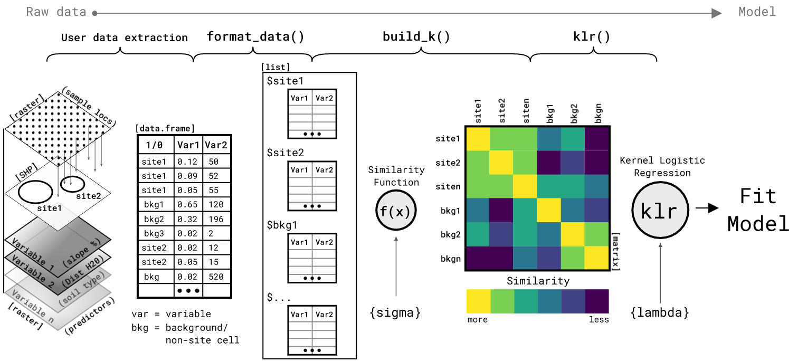
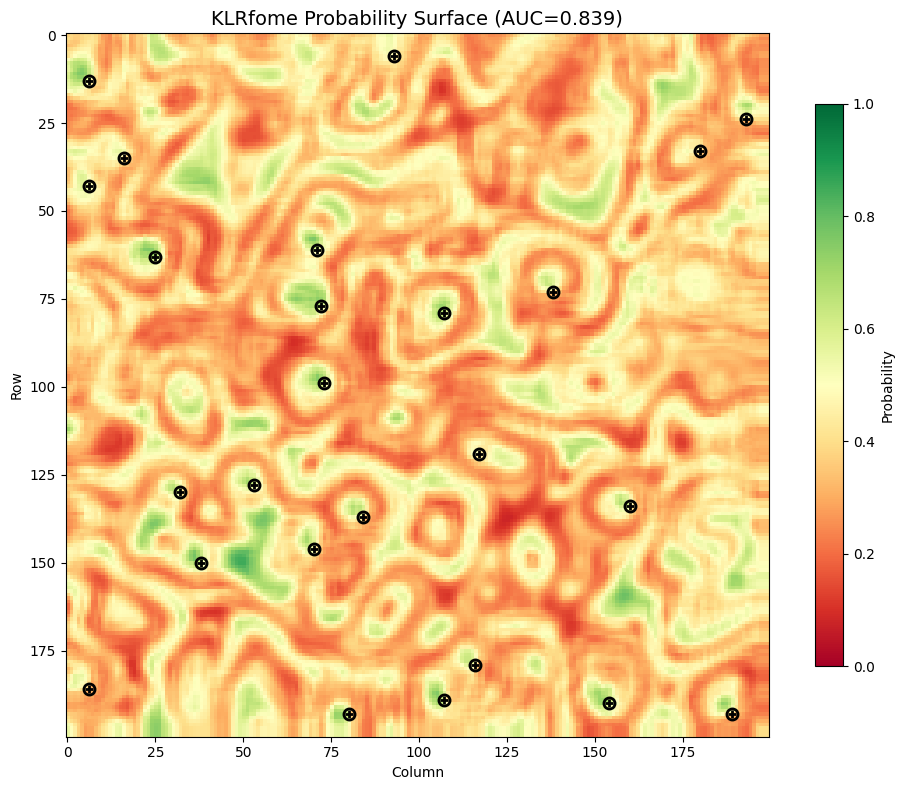

# KLRfome

[](https://github.com/mrecos/KLRFome_JAX/actions/workflows/ci.yml)
[](https://www.python.org/downloads/)
[](#license)
[](https://doi.org/10.21105/joss.00722)

<p align="center">
  
</p>

**Kernel Logistic Regression on Focal Mean Embeddings:** distribution regression for spatial
presence-background modelling in Python and JAX.

KLRfome models a site as a distribution of environmentally correlated cells. It avoids both
collapsing a site to a centroid or feature mean and treating every cell as an independent
observation. During prediction, overlapping focal windows traverse the landscape; each window is
represented as a distribution and compared with the distributions observed at training sites.

> [!IMPORTANT]
> With presence-background data, KLRfome produces **relative suitability scores**, not calibrated
> occurrence probabilities. Background samples describe the available environment; they are not
> confirmed absences.

## Why distribution regression?

Many spatial modelling workflows force a site into one of two unsuitable representations:

1. one feature vector per site, which discards within-site environmental variation; or
2. one observation per cell, which overstates the effective sample size because cells within a
   site are spatially correlated.

KLRfome instead treats the complete bag of cells as the labelled observation. The same logic
applies to archaeological sites, habitat patches, land parcels, watersheds, and other spatial
units whose internal distribution may carry information.

<p align="center">
  
</p>

The name describes the original method: **K**ernel **L**ogistic **R**egression on **Fo**cal
**M**ean **E**mbeddings (KLRfome, pronounced “clear foam”).

## Implemented methods

The current API separates the bag representation, bag-level decision rule, and solver.

| ID | Bag representation | Bag-level decision rule | Solver |
|---|---|---|---|
| **M0** | Exact RBF kernel mean embedding | Linear RKHS inner product | Dual KLR |
| **M1** | Random Fourier feature mean embedding | Linear | Primal regularized logistic regression |
| **M2** | Random Fourier feature mean embedding | RBF | Dual KLR |
| **M3** | Fixed-quantile sliced Wasserstein-2 | RBF | Dual KLR |

M0 preserves the original distribution-regression lineage. M1 offers a scalable explicit
mean-embedding approximation, M2 adds a nonlinear decision kernel over that embedding, and M3
compares projected distributional shape. No method is treated as universally preferred; method
comparisons must use the same bags and spatial validation folds.

## Installation

KLRfome is currently installed from source:

```bash
git clone https://github.com/mrecos/KLRFome_JAX.git
cd KLRFome_JAX

python -m venv .venv
source .venv/bin/activate  # Windows: .venv\Scripts\activate
python -m pip install --upgrade pip
python -m pip install -e .
```

For tests and development tooling:

```bash
python -m pip install -e ".[dev]"
```

JAX uses the CPU by default. Install a platform-appropriate JAX build separately when GPU
acceleration is required.

## Quick start

The repository includes a deterministic synthetic raster example. This workflow is also executed
by continuous integration through [`examples/readme_quickstart.py`](examples/readme_quickstart.py).

```python
from pathlib import Path

import geopandas as gpd
import numpy as np

from klrfome import KLRfome, ModelSpec, RasterStack

root = Path("example_data")
rasters = RasterStack.from_files(
    [str(root / name) for name in ("var1.tif", "var2.tif", "var3.tif")]
)
sites = gpd.read_file(root / "sites.geojson")

model = KLRfome(
    spec=ModelSpec.m1(rff_features=256),
    lambda_reg=0.1,
    window_size=5,
    seed=42,
)

training = model.prepare_data(
    raster_stack=rasters,
    sites=sites,
    n_background=25,
    samples_per_location=20,
)
model.fit(training)

suitability = np.asarray(
    model.predict(rasters, batch_size=512, show_progress=True)
)
print(suitability.shape)
print(float(np.nanmin(suitability)), float(np.nanmax(suitability)))
```

This example uses M1 for an efficient mean-embedding workflow. Replace the specification with
`ModelSpec.m0()`, `ModelSpec.m2()`, or `ModelSpec.m3()` to use another supported architecture.
Run the complete example with:

```bash
python examples/readme_quickstart.py --full-surface
```

<p align="center">
  
</p>

## Data inputs

The canonical objects are `Bag` and `BagDataset`. A bag contains a finite cell-by-feature sample
array, its label and ID, optional per-cell coordinates, grouping and stratum IDs, and metadata. A
dataset adds feature order, CRS, and a declared `presence_background` or `presence_absence` study
design.

KLRfome supports:

- **tabular cell data** with site IDs, labels, coordinates, and covariates;
- **aligned raster covariates** through lazy Rasterio-backed window extraction;
- **point sites** with an explicit spatial buffer or pixel window;
- **polygon sites** using all valid covered cells; and
- **spatial background bags** sampled from the common all-band raster validity mask.

Tabular and raster paths return the same validated `BagDataset` contract. For large raster inputs,
use `RasterSource` so prediction and extraction read windows rather than materializing the entire
stack in JAX.

See [MODEL_DATA_FOUNDATION.md](MODEL_DATA_FOUNDATION.md) for the complete model, data, and
compatibility contract.

## Focal prediction

The “F” in KLRfome is operational, not historical. At prediction time an overlapping focal window
moves across the raster. Each valid window becomes a new bag, is transformed with the fitted
training preprocessor, and receives a relative-suitability score from the fitted distribution
model.

Canonical traversal uses stride 1. Coarser strides are useful for interactive previews but produce
a sparse set of focal anchors rather than the complete prediction surface. Prediction batching
controls memory without changing the fitted model or focal-window definition.

## Validation and interpretation

Spatially grouped validation keeps related sites or spatial blocks together and fits scaling,
bandwidths, and model parameters using training folds only. All methods in a comparison receive
the same immutable fold plan.

Useful presence-background diagnostics include:

- ROC AUC as a secondary ranking summary;
- PR AUC, interpreted relative to the constructed background prevalence;
- continuous Boyce index;
- top-area capture and lift; and
- direct inspection of mapped predictions.

Mapped predictions are especially important because spatial artifacts and support mismatches can
be difficult to identify from aggregate metrics alone.

## Project status

The Python/JAX model and data foundation, M0–M3 reference methods, tabular/raster ingestion,
spatial validation, and focal prediction workflow are implemented and tested. The current real-data
comparison covers one physio-shed and should not be used for final method ranking.

Open methodological decisions include:

- pooling or partial pooling across physio-sheds with sparse site counts;
- calibration for study designs that provide the information required for it;
- learned or multiscale distribution representations; and
- final method selection across multiple realistic data settings.

## Documentation and examples

- [Model and data foundation](MODEL_DATA_FOUNDATION.md)
- [Methods status and roadmap](METHODS_ROADMAP_2026-07-13.md)
- [Section 6 comparison summary](SECTION6_COMPARISON_SUMMARY_2026-07-13.md)
- [Section 6 validation notebook](notebooks/05_section6_model_validation.ipynb)
- [Synthetic methods laboratory](SYNTHETIC_METHODS_LAB.md)
- [Synthetic laboratory core results (2026-07-15)](SYNTHETIC_LAB_RESULTS_2026-07-15.md)
- [Synthetic methods notebook](notebooks/06_synthetic_methods_lab.ipynb)
- [R-to-Python/JAX methodological comparison](COMPARISON_R_vs_JAX.md)
- [Synthetic example data](example_data/README.md)

Generated research data and validation results under `site_data/` are intentionally excluded from
version control.

## Development

```bash
python -m pytest tests/ -v
python -m black --check klrfome tests examples
python -m ruff check klrfome tests examples
python -m mypy klrfome
```

GitHub Actions runs the test suite, style checks, type checks, and the README quick-start smoke
workflow on every push and pull request.

## History and citation

KLRfome was originally developed in R and published in the *Journal of Open Source Software*:

> Harris, M. D. (2019). KLRfome — Kernel Logistic Regression on Focal Mean Embeddings.
> *Journal of Open Source Software*, 4(35), 722.
> <https://doi.org/10.21105/joss.00722>

The [original R repository](https://github.com/mrecos/klrfome) and its historical documentation
remain available for provenance. This repository contains the current Python/JAX implementation.

## Acknowledgments

The methodology builds on kernel mean embeddings and distribution regression, including work by
Szabó, Gretton, Póczos, Sriperumbudur, Muandet, Fukumizu, Schölkopf, Zhu, and Hastie. The original
project also benefited from correspondence with Zoltán Szabó and support from Ben Marwick.

## License

- **Code:** MIT
- **Text and figures:** [CC BY 4.0](https://creativecommons.org/licenses/by/4.0/)
- **Example data:** [CC0](https://creativecommons.org/publicdomain/zero/1.0/)

## Selected references

- Harris, M. D. (2019). KLRfome — Kernel Logistic Regression on Focal Mean Embeddings. *JOSS*,
  4(35), 722.
- Muandet, K., Fukumizu, K., Sriperumbudur, B., & Schölkopf, B. (2017). Kernel mean embedding of
  distributions: A review and beyond. *Foundations and Trends in Machine Learning*, 10(1–2),
  1–141.
- Szabó, Z., Sriperumbudur, B., Póczos, B., & Gretton, A. (2016). Learning theory for distribution
  regression. *Journal of Machine Learning Research*, 17, 1–40.
- Zhu, J., & Hastie, T. (2005). Kernel logistic regression and the import vector machine. *Journal
  of Computational and Graphical Statistics*, 14(1), 185–205.
